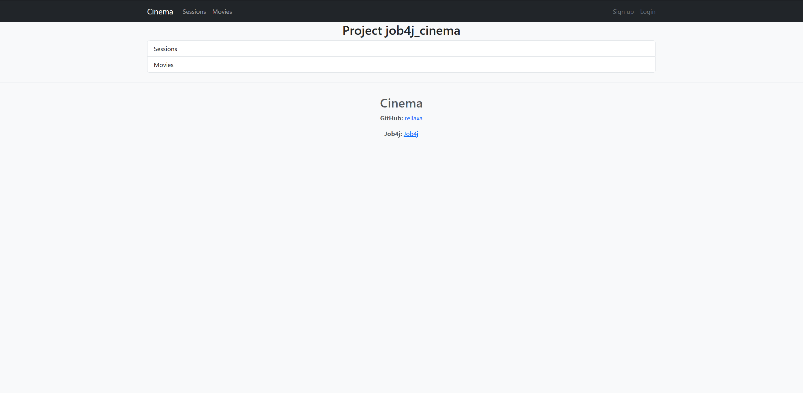
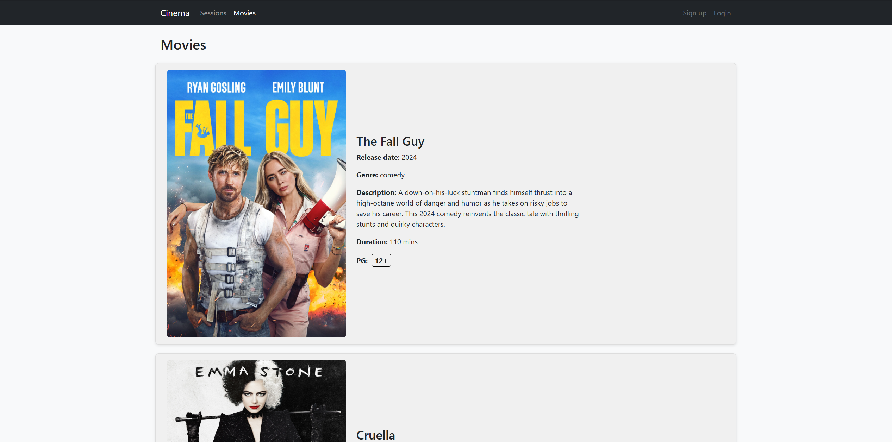
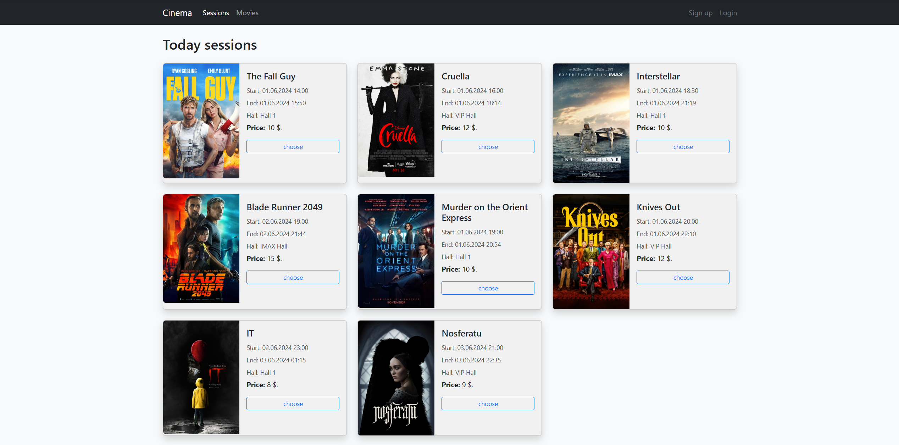
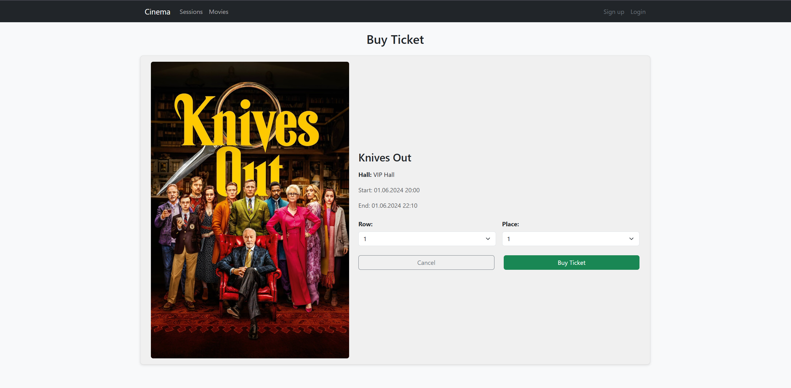
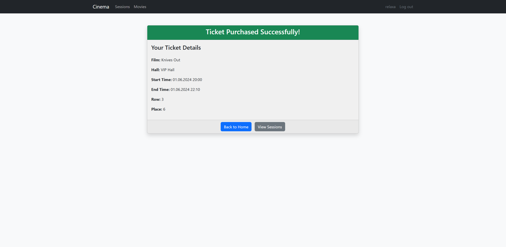
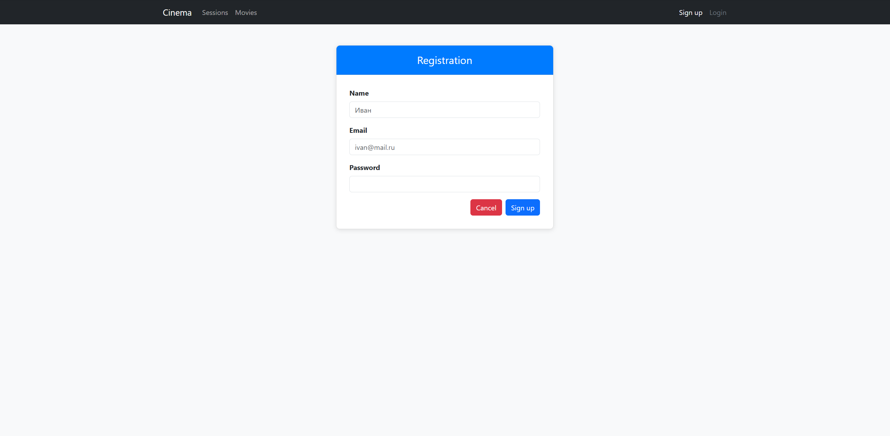
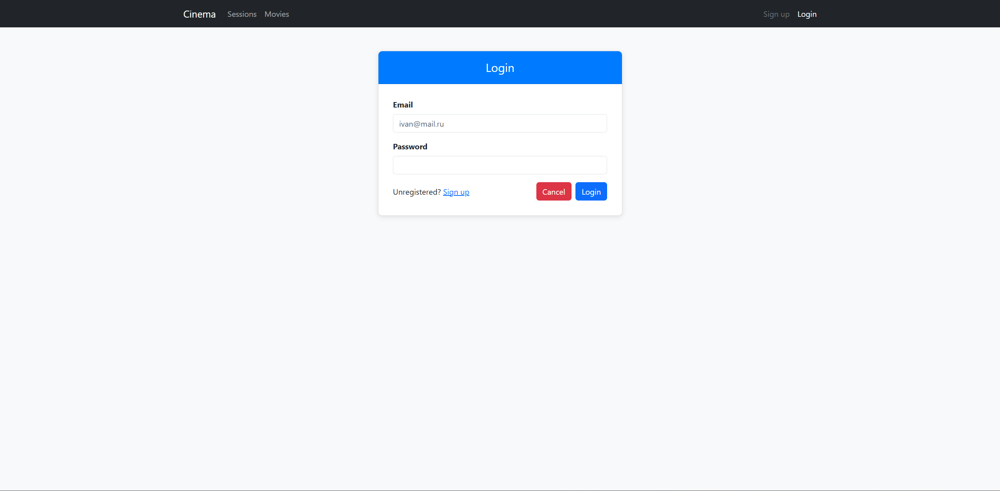

# Project Cinema - job4j_cinema

---

## Description

Project Cinema is a cinema service that enables users to register, view a list of films and upcoming screenings, and
purchase tickets. While anyone can browse the film schedule, only registered users are allowed to buy tickets.

## Features

- **User Registration & Authorization:** Secure sign-up and login functionality.
- **Film & Screening Listings:**
    - View a comprehensive list of films.
    - Check upcoming movie screenings.
- **Ticket Purchase:**
    - Registered users can purchase tickets.
    - Unregistered users attempting to buy a ticket will be redirected to the login page.

## Technology Stack

- **Spring Boot:** 3.4.2
- **PostgreSQL:** 14
- **H2 Database:** 2.3.232
- **Sql2o:** 1.6.0
- **Thymeleaf:** Template engine for rendering views.
- **Bootstrap:** For responsive front-end design.
- **Liquibase:** 4.29.2 for database migrations.
- **Lombok:** 1.18.36 for reducing boilerplate code.

## Environment:

- **Java:** 17
- **Maven:** 3.8
- **PostgreSQL:** 14

---

## Project Launch

Follow these steps to run the project locally:

1. **Clone the Repository:**
   ```bash
   git clone https://github.com/rellaxa/job4j_cinema

2. **Create the Database:**
   ```sql
   create database cinema;

3. **Assemble the Project:**
    ```bash
   mvn clean install

4. **Launch the Application:**

- Via Maven:
  ```bash
    mvn spring-boot:run
- Or run the Job4jCinemaApplication main class directly from your IDE.

5. **Access the Application:** Open your browser and navigate to http://localhost:8080.

---

## Interaction with the Application

1. **Main:**  
   

2. **Movies:**  
   

3. **Sessions:**  
   

4. **Ticket Purchase:**  
   

5. **Success:**  
   

6. **Registration:**  
   

7. **Login:**  
   

